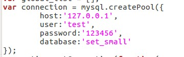
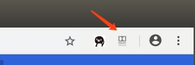
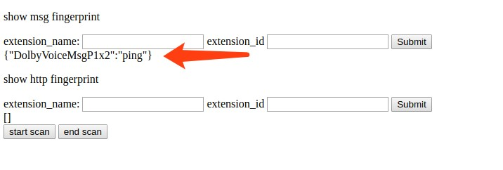
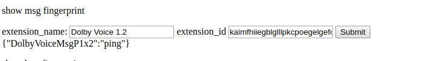
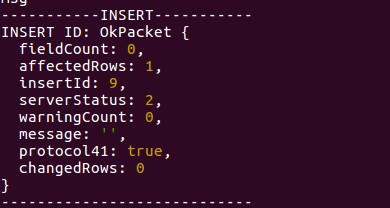
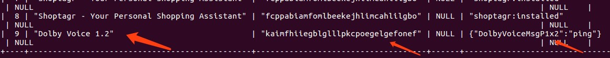
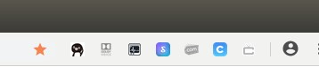
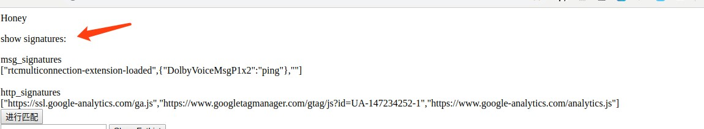
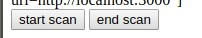
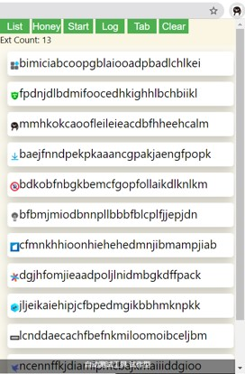

基于浏览器拓展指纹的隐私推演
============================

___Honey Site：蜜罐网站___
---------------
### 开发工具：
+ npm 6.14.4
+ mysql 14.14

### 准备工作：
1. 进入/honey_pro/project目录下 输入 npm install 进行相关依赖的安装
2. 在project目录下，在terminal中通过`mysql –u 用户名 –p`，然后输入个人的密码进入mysql交互端，输入命令`source set_small.sql`导入指纹库demo set_small到本地mysql
3. 打开/project目录下的routes文件夹，修改第五行起的代码为本机的数据库设置
<div align=center></div>

4. 在/project目录下，输入npm start启动项目，在浏览器输入http://localhost:3000可访问honeysite

### 代码目录结构/作用：
+ /bin:用来启动应用（服务器）
+ /public: 存放静态资源目录
+ /routes：路由，用于确定应用程序如何响应对特定端点的客户机请求，包含一个 URI（或路径）和一个特定的 HTTP 请求方法（GET、POST 等）。每个路由可以具有一个或多个处理程序函数，这些函数在路由匹配时执行。
    - users.js 系统自动生成的，没有使用
    - index.js 里面规定了文档中介绍的/add和/query api的路由，以及处理函数，即实现与数据库交互（添加、查询）的功能。
    - /views: 模板文件所在目录 文件格式为
    - error.html 返回错误页面
    - index.html honeysite的主页面
    - layout.jade 系统自动生成 在此没有使用

目录至app.js程序main文件，它是服务器启动的入口

### 使用方法：
__指纹录入阶段__
1. 打开待测试的拓展程序  
<div align=center></div>

2. 稍等一会儿，honeysite如果捕获到扩展程序的msg指纹，或者http指纹，会出现下方表单，可以看到此扩展存在msg指纹  
<div align=center></div>

3. 根据扩展程序的details页面，填写测试扩展程序的uuid和名称，则可将信息录入指纹库  
<div align=center></div>

4. 可以看到后端terminal输出了数据库添加成功信息  
<div align=center></div>

5. 查看数据库，添加新的指纹、扩展信息  
<div align=center></div>

__指纹匹配阶段__
1. 启动多个样本库中的扩展程序，打开honeysite  
<div align=center></div>

2. 等待一会儿，等honysite如下图上的部分显示了所有捕获的信息，并出现进行匹配按钮
<div align=center></div>

3. 点击进行匹配会在下方出现匹配结果

__统计__
在启动autotester之前点击start scan， autotester结束后点击end scan显示统计指纹信息  
<div align=center></div>

___WAR检测脚本___ 
---------------
fingerprinting.js为资源检测脚本的模板。

通过gen_fp.py程序处理扩展程序的目录，从扩展程序的manifest.json配置文件中的web accessible resources清单里提取资源文件的路径，扫描目录展开成完整的资源路径，补充在检测脚本的前面，生成扩展程序的指纹检测脚本。


___AutoTester：自动测试工具___
---------------
### 开发工具：
+ JQuery
+ Node.js
+ Browserify

### 使用方法：
打开Chrome浏览器，进入拓展管理页面，在右上角打开开发者模式，随后将包含文件Manifest.json的目录直接拖动到Chrome窗口中安装该拓展
<div align=center></div>
拓展的界面包含六个按钮：  

+ List：在调试窗口打印已安装拓展的详细信息
+ Honey：打开蜜罐网页（需要在代码中正确配置网站地址）
+ Start：对当前有效的n个拓展（n显示在按钮下方），遍历进行指纹采集
+ Log：打印日志信息
+ Tab：确认打开honeysite（可使用Honey按钮或直接打开）后，需要点击该按钮，确认下方显示一个表示Tab序号的数字后，方可点击Start开始
+ Clear：卸载当前已安装拓展（除自身）

### 代码目录结构/作用：
（这里只列出核心的代码文件，其他文件无需更改）
+ popup.js/.html：拓展弹出窗口的代码，是该拓展的主要代码
+ content.js：在运行时会自动嵌入到当前页面的代码
+ bundle.js: 由popup.js经转换后的文件。若需要更新拓展逻辑，有两种方法：
    - （推荐）修改popup.js后，使用如下命令：
    `browserify main.js -o bundle.js`

___genjson：拓展安装脚本___
---------------

使用该脚本为指定目录下的crx文件（Chrome拓展安装包）逐一生成json格式的安装脚本。使用前需要修改如下部分：

```python
db = pymysql.connect("127.0.0.1", "test", "123456", "set_small")
cursor = db.cursor()

crxdir = '/home/honey/Desktop/test/k'
folder = crxdir.split('/')[-1]
output_path = crxdir+ r"/../" + folder + r"_json/"
```

中的文件目录、数据库连接选项为正确的值。生成的json文件默认存放在和crx目录同级的`$DIR.OF.CRX$_json`目录下。安装拓展时，将对应的UUID的json文件移动至目录`/opt/google/chrome/extensions/`即可。
